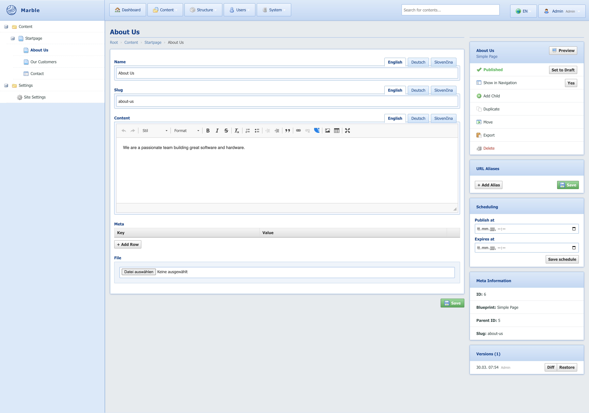
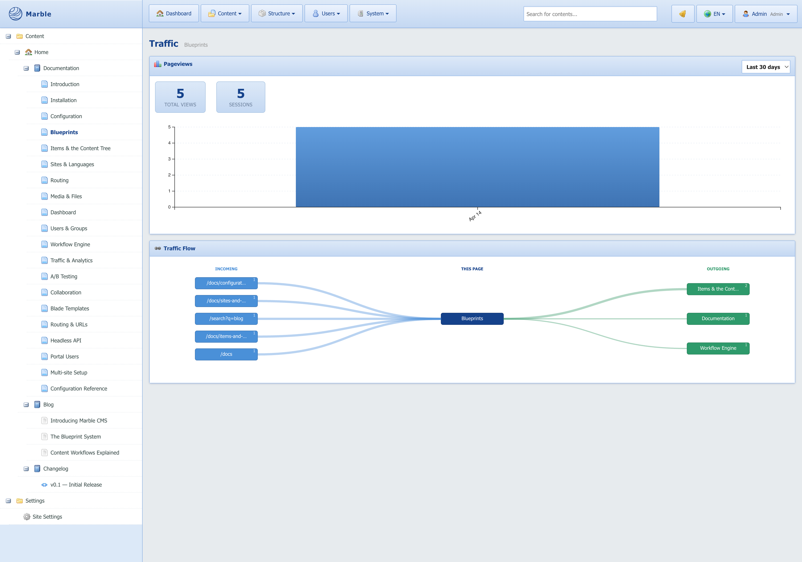
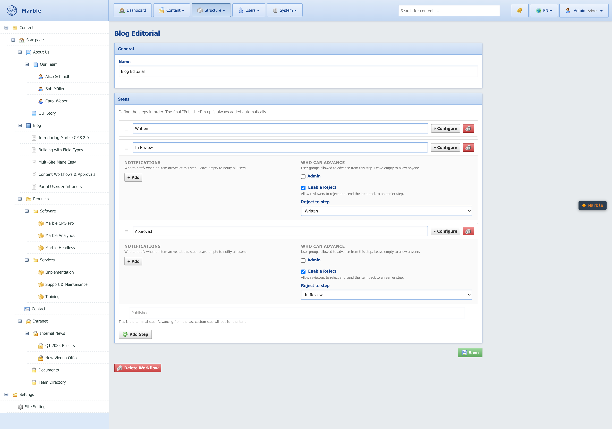
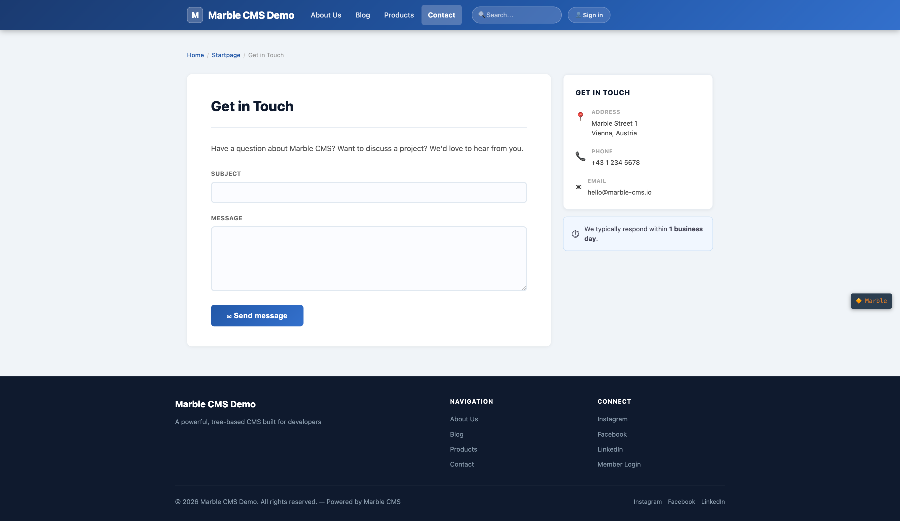

# Marble CMS

<table>
<tr>
  <td width="33%"></td>
  <td width="33%"></td>
  <td width="33%"></td>
</tr>
<tr>
  <td width="33%"></td>
  <td width="33%"></td>
  <td width="33%"></td>
</tr>
<tr>
  <td width="33%"></td>
  <td></td>
  <td></td>
</tr>
</table>

A Laravel CMS package built around a flexible Blueprint + Field Type system. Define your content types visually, manage a hierarchical content tree, and deliver content via Blade templates or a headless JSON API.

**[→ Full Documentation](https://github.com/marblecms/admin/wiki)**

## Requirements

- PHP 8.2+
- Laravel 11+
- MySQL 8+

## Installation

Use the [demo repository](https://github.com/marblecms/demo) as your starting point — it comes pre-configured with Docker, routing, and Blade templates.

```bash
git clone --recurse-submodules https://github.com/marblecms/demo
cd demo
cp .env.example .env
docker compose up -d
docker compose exec app php artisan marble:install
```

`marble:install` runs migrations, seeds the initial content tree, registers built-in field types, and publishes admin assets.

Default login after install:

```
Email:    admin@admin
Password: admin
```

## Configuration

Publish the config file:

```bash
php artisan vendor:publish --tag=marble-config
```

`config/marble.php`:

| Key                  | Default   | Description                                                          |
|----------------------|-----------|----------------------------------------------------------------------|
| `route_prefix`       | `admin`   | URL prefix for the admin panel                                       |
| `guard`              | `marble`  | Auth guard used by the admin                                         |
| `primary_locale`     | `en`      | Language code used for non-translatable fields                       |
| `locale`             | `en`      | Default locale for the current request                               |
| `uri_locale_prefix`  | `false`   | Prefix frontend URLs with language code (`/en/about`, `/de/ueber-uns`) |
| `entry_item_id`      | `1`       | Fallback root item ID for the tree (overridden by user group setting) |
| `frontend_url`       | `''`      | Base URL used for preview links (set via `MARBLE_FRONTEND_URL`)      |
| `cache_ttl`          | `3600`    | Item cache lifetime in seconds. `0` disables caching                 |
| `lock_ttl`           | `300`     | Seconds a content lock stays valid before expiring                   |
| `autosave`           | `false`   | Enable autosave on the item edit form                                |
| `autosave_interval`  | `30`      | Seconds after last change before autosave fires                      |
| `storage_disk`       | `public`  | Laravel storage disk for media uploads                               |
| `auto_routing`       | `false`   | Register a catch-all frontend route automatically (no `routes/web.php` entry needed) |

Many of these can also be changed at runtime via **Dashboard → Configuration** in the admin.

## Content Model

### Items

Items are nodes in a hierarchical content tree stored with materialized paths (`/1/3/7/`). Every item has:

- A **Blueprint** (content type definition)
- A **status** (`published` / `draft`)
- Optional **scheduling** (`publish_at`, `expires_at`)
- An optional **slug** per language
- A **show in navigation** flag

### Blueprints

Blueprints define content types. Each blueprint has:

| Option              | Description                                                                 |
|---------------------|-----------------------------------------------------------------------------|
| **Fields**          | Visual field builder with drag-and-drop ordering and group assignment       |
| **Allow Children**  | Whether items of this type can have child items                             |
| **List Children**   | Show a child item list in the admin edit view                               |
| **Show in Tree**    | Whether this blueprint appears in the sidebar tree                          |
| **Versionable**     | Record a full revision on every save; diff any two revisions                |
| **Schedulable**     | Enable `publish_at` / `expires_at` per item                                 |
| **Is Form**         | Treat items of this type as contact forms; collect submissions from frontend |
| **Hide System Fields** | Hide the built-in name/slug fields in the editor (useful for settings items) |
| **Locked**          | Prevent field edits in the admin (content is read-only)                     |
| **Inherits From**   | Prepend all fields from a parent blueprint (read-only in the editor)        |
| **Icon**            | Choose from 997 Famfamfam Silk icons via searchable picker                  |
| **Allowed Child Blueprints** | Restrict which blueprints can be added as children              |

### Field Types

Built-in field types:

| Identifier           | Description                                           |
|----------------------|-------------------------------------------------------|
| `textfield`          | Single-line text                                      |
| `textblock`          | Multi-line textarea                                   |
| `htmlblock`          | WYSIWYG rich text (CKEditor)                          |
| `image`              | Single image upload with focal point                  |
| `images`             | Multiple images                                       |
| `file`               | Single file attachment                                |
| `files`              | Multiple file attachments with drag-to-reorder        |
| `checkbox`           | Boolean toggle                                        |
| `selectbox`          | Dropdown with configurable options                    |
| `date`               | Date picker                                           |
| `datetime`           | Date + time picker                                    |
| `time`               | Time picker                                           |
| `object_relation`    | Link to another Item (with configurable on-delete behavior) |
| `object_relation_list` | Multiple Item references                            |
| `keyvalue_store`     | Arbitrary key/value pairs                             |
| `repeater`           | Repeatable rows of named sub-fields                   |

Each field can be marked **Translatable** (separate value per language), **Locked** (read-only in the editor), and given optional **Validation Rules** (Laravel validation syntax, e.g. `required|max:255`).

### Custom Field Types

Implement `FieldTypeInterface` and register in a service provider:

```php
use Marble\Admin\Facades\Marble;

Marble::registerFieldType(new MyCustomFieldType());
```

## The Marble Facade

```php
use Marble\Admin\Facades\Marble;

// Resolve a URL path to a published Item (returns null if not found)
$item = Marble::resolve('/about/team');
$item = Marble::resolveOrFail('/about/team'); // aborts with 404

// Read field values
$item->value('title');           // current locale
$item->value('title', 'de');     // specific locale
$item->value('title', 2);        // by language ID

// URL generation
Marble::url($item);              // full URL including frontend_url base
Marble::url($item, 'de');        // URL in a specific locale

// Tree navigation
Marble::navigation();            // full tree from the current site root
Marble::navigation(5);           // tree from item 5
Marble::navigation(5, 2);        // max 2 levels deep
Marble::breadcrumb($item);       // ancestor chain (Collection of Items)
Marble::children($item);         // published direct children
Marble::children($item, 'article'); // filtered by blueprint identifier

// Site settings
Marble::settings();              // returns the settings Item for the current site
Marble::settings()->value('site_name');

// Language
Marble::currentLanguageId();     // ID of the active language
Marble::primaryLanguageId();     // ID of the primary/fallback language
```

## Frontend Routing

### Manual (recommended)

In `routes/web.php`:

```php
Marble::routes(function (\Marble\Admin\Models\Item $item) {
    return view(Marble::viewFor($item), ['item' => $item]);
});
```

`Marble::viewFor($item)` looks for `resources/views/marble-pages/{blueprint_identifier}.blade.php` and falls back to `resources/views/marble-pages/default.blade.php`.

### Automatic

Set `auto_routing = true` in config (or `MARBLE_AUTO_ROUTING=true` in `.env`) and Marble registers the catch-all route itself. No `routes/web.php` entry needed.

### Locale Prefix

Set `uri_locale_prefix = true` to prefix all frontend URLs with the language code:

```
/en/about-us
/de/ueber-uns
```

`Marble::url($item)` and `Marble::resolve($path)` both handle the prefix automatically.

## Sites & Multi-site

Configure multiple sites under **System → Sites**. Each site has:

- **Domain** — hostname without protocol (e.g. `example.com`)
- **Root Item** — the top-level content node for this site's tree
- **Settings Item** — an Item of any blueprint used as site-wide settings (branding, SEO, contact, etc.). Accessible via `Marble::settings()`.
- **Default Language** — fallback locale for this site
- **Is Default** — used when no domain matches (localhost, IP access)

The `Marble::settings()` method returns the settings Item for the active site, falling back to the default site if none is set. This makes site-wide configuration available in any Blade template:

```blade
{{ Marble::settings()->value('site_name') }}
{{ Marble::settings()->value('email') }}
```

## Scheduled Publishing

When **Schedulable** is enabled on a blueprint, each item gains **Publish At** and **Expires At** fields. `Item::isPublished()` respects these automatically. Process them via the scheduler:

```bash
php artisan marble:publish-scheduled
```

Add to `routes/console.php`:

```php
Schedule::command('marble:publish-scheduled')->everyMinute();
```

## Revision History

When **Versionable** is enabled on a blueprint, a full snapshot is saved on every save. In the item edit view, the **Versions** sidebar shows the revision list. Each revision can be:

- **Restored** — resets the item to that revision's content
- **Diffed** — side-by-side field comparison between any two revisions

## Content Locking

When a user opens an item for editing, Marble acquires a lock for `lock_ttl` seconds. If another user opens the same item, a warning banner is shown. Locks expire automatically.

## Trash & Soft Delete

Deleted items are soft-deleted and appear in **Dashboard → Trash**. From there items can be:

- **Restored** — moved back into the tree at their original position
- **Permanently deleted** — removed along with all their values and media references

## URL Aliases

In the item edit sidebar, any item can have additional URL aliases per language. Aliases are validated against other aliases and existing slugs to prevent conflicts.

## Activity Log

Every content action (create, save, publish, draft, duplicate, move, delete, restore) is recorded with the user and timestamp. Browse the full log under **Dashboard → Activity Log** or see a paginated feed on the dashboard.

## Media Library

Upload files and images via **System → Media**. Features:

- **Folders** — organise files into a folder tree
- **Focal Point** — click to set the crop anchor; all resized images respect it
- **On-the-fly resizing** via the built-in image controller:

```
/image/{filename}                   ← original
/image/{width}/{height}/{filename}  ← resized / cover-cropped to focal point
```

All uploaded files are served publicly. Do not upload sensitive documents.

## Contact Forms

Set **Is Form** on a blueprint to enable form submission collection. The `<x-marble::marble-form>` component renders the form on the frontend and stores submissions in the database. Configure per item:

- **Recipients** — comma-separated email addresses for notifications
- **Success Message** — shown after submit
- **Success Redirect** — redirect to another item after submit

Submissions appear in the item edit view under **Submissions**, with unread highlighting and mark-as-read.

## Webhooks

Register webhooks under **System → Webhooks**. Marble fires HTTP POST requests on:

- `item.created`, `item.saved`, `item.published`, `item.draft`
- `item.deleted`, `item.duplicated`, `item.moved`, `item.reverted`

Optionally set a **Secret** for HMAC SHA256 signatures sent via `X-Marble-Signature`.

## Redirect Manager

Manage 301/302 redirects under **System → Redirects**. The `HandleMarbleRedirects` middleware intercepts 404 responses and checks the redirect table. Hit counts are tracked automatically.

## Headless JSON API

Create API tokens under **Dashboard → API Tokens**. Pass as a Bearer token:

```
GET /api/marble/items/{blueprint}
GET /api/marble/item/{id}
GET /api/marble/resolve?path=/about/team
```

Blueprints must have **Allow Public API** enabled to be accessible.

## Marble Packages

Export and import complete blueprint definitions (including custom field types) as `.zip` packages via **Dashboard → Packages**. Useful for moving content schemas between projects or distributing reusable content types.

## User Groups & Permissions

Users belong to a **User Group**. Groups control:

- **Permissions** — granular create/edit/delete/list flags for users, blueprints, and groups
- **Allowed Blueprints** — which blueprints the group's users can create items with
- **Root Node** — restrict the visible content tree to a specific subtree

## License

MIT
