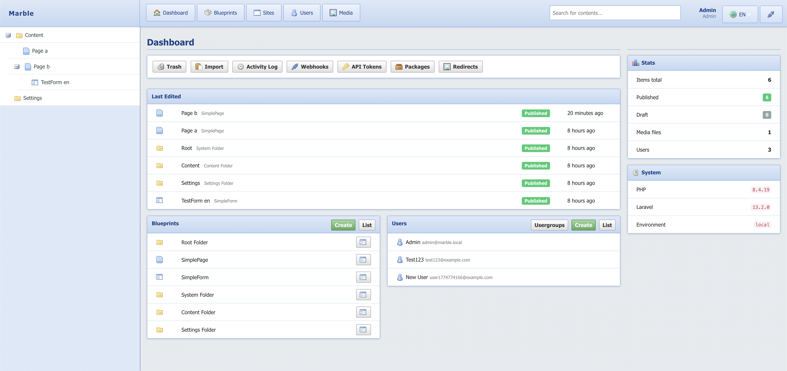
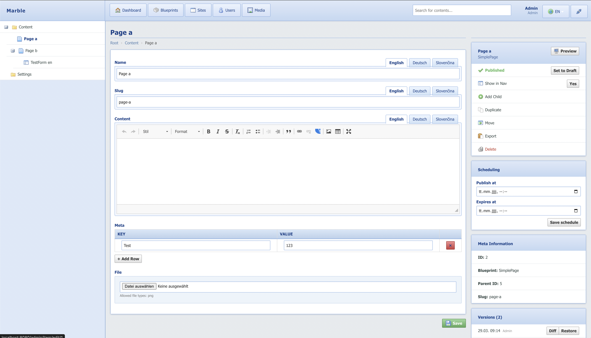
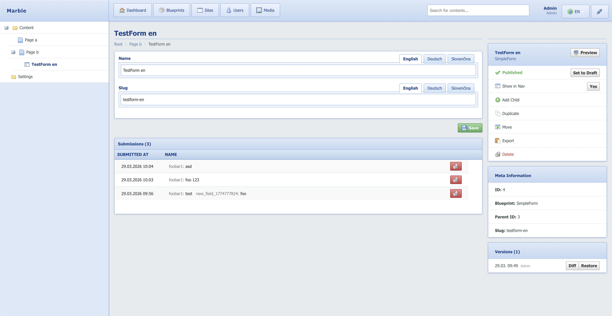

# Marble CMS





A Laravel CMS package built around a flexible Blueprint + Field Type system. Define your content types visually, manage a hierarchical content tree, and deliver content via Blade templates or a headless JSON API.

## Requirements

- PHP 8.2+
- Laravel 11+
- MySQL 8+

## Installation

Use the [demo repository](https://github.com/marblecms/demo) as your starting point — it comes pre-configured with Docker, routing, and Blade templates.

```bash
git clone --recurse-submodules https://github.com/marblecms/demo
cd demo
cp .env.example .env
docker compose up -d
docker compose exec app php artisan marble:install
```

`marble:install` runs migrations, seeds the initial tree (Root → Content → Startpage, About Us, Our Customers, Contact), registers built-in field types, and publishes admin assets.

Default login after install:

```
Email:    admin@admin
Password: admin
```

## Configuration

Publish the config file:

```bash
php artisan vendor:publish --tag=marble-config
```

`config/marble.php` options:

| Key                | Default     | Description                                      |
|--------------------|-------------|--------------------------------------------------|
| `route_prefix`     | `admin`     | URL prefix for the admin panel                   |
| `entry_item_id`    | `1`         | Root item ID shown in the content tree           |
| `locale`           | `en`        | Default content locale                           |
| `primary_locale`   | `en`        | Primary language for non-translatable fields     |
| `frontend_url`     | `''`        | Base URL shown in preview links                  |
| `auto_routing`     | `false`     | Register a catch-all frontend route automatically|

## Frontend Routing

In `routes/web.php`:

```php
use Marble\Admin\Facades\Marble;

Marble::routes(function (\Marble\Admin\Models\Item $item) {
    return view(Marble::viewFor($item), ['item' => $item]);
});
```

Place Blade templates in `resources/views/marble-pages/{blueprint-identifier}.blade.php`. A `default.blade.php` is used as fallback.

## The Item Model

```php
use Marble\Admin\Facades\Marble;

// Resolve a path to an Item
$item = Marble::resolve('/about/team');

// Read field values
$item->value('title');           // current locale
$item->value('title', 'de');     // specific locale
$item->value('title', 2);        // by language ID

// Navigation helpers
Marble::navigation();        // full tree from current site's root
Marble::navigation(1);       // full tree from item 1
Marble::navigation(1, 2);    // max 2 levels deep
Marble::breadcrumb($item);

// URL generation
Marble::url($item);
Marble::url($item, 'de');

// Children
Marble::children($item, 'article');  // published children of blueprint 'article'
```

## Field Types

Built-in field types:

| Identifier   | Description                        |
|--------------|------------------------------------|
| `text`       | Single-line text                   |
| `textblock`  | Multi-line textarea                |
| `richtext`   | WYSIWYG (CKEditor)                 |
| `image`      | Single image upload                |
| `images`     | Multiple images                    |
| `file`       | File attachment                    |
| `checkbox`   | Boolean toggle                     |
| `selectbox`  | Dropdown (configurable options)    |
| `date`       | Date picker                        |
| `datetime`   | Date + time picker                 |
| `time`       | Time picker                        |
| `number`     | Numeric input                      |
| `objectrelation` | Link to another Item           |
| `objectrelationlist` | Multiple Item references   |
| `repeater`   | Repeatable row of sub-fields       |

### Custom Field Types

Implement `FieldTypeInterface` and register in a service provider:

```php
use Marble\Admin\Facades\Marble;

Marble::registerFieldType(new MyCustomFieldType());
```

## Blueprints

Blueprints are content type definitions. Configure them in the admin under **Blueprints**:

- **Fields** — drag-and-drop field builder
- **Schedulable** — enable `publish_at` / `expires_at` per item
- **Versionable** — enable revision history
- **Allow Children** — whether items can have child items
- **Show in Tree** — whether the blueprint appears in the sidebar tree
- **Is Form** — treat items of this type as contact forms

## Scheduled Publishing

When `schedulable` is enabled on a blueprint, each item gains **Publish At** and **Expires At** fields. `Item::isPublished()` respects these automatically. Run a scheduler to process them:

```bash
php artisan marble:publish-scheduled
```

Add to your cron (or `routes/console.php`):

```php
Schedule::command('marble:publish-scheduled')->everyMinute();
```

## Headless JSON API

Enable API access by creating an API Token in the admin dashboard. Pass it as a Bearer token:

```
GET /api/marble/items/{blueprint}
GET /api/marble/item/{id}
GET /api/marble/resolve?path=/about/team
```

## Redirect Manager

Manage 301/302 redirects in the admin under **Dashboard → Redirects**. The `HandleMarbleRedirects` middleware is registered automatically and intercepts 404 responses.

## Multi-Language

Languages are managed in the admin. Each field can be marked translatable. The admin user interface language is set per-user via the language dropdown in the header.

## Marble Packages (Blueprint Export/Import)

Export and import complete blueprint definitions (including field types) as `.zip` packages via **Dashboard → Packages**. Useful for moving content schemas between projects.

## Image Serving

Marble serves images through a built-in controller with on-the-fly resizing:

```
/image/{filename}                   ← original
/image/{width}/{height}/{filename}  ← resized / cover-cropped
```

Set a **focal point** per image in the media library. Cover crops respect the focal point so the important part of the image is always visible.

## Webhooks

Register webhooks in the admin to notify external services when content changes. Triggered automatically on item save/publish/delete.

## License

MIT
